 

## 📊 GitHub Stats:

 
 

#### 📘 About Me

- 🍃 未来は創るものだ。
- 🍥 Full Stack Developer
- 🩷 AI & Automation Enthusiast
- 📒 Building Tools for Students Worldwide
- 🍋‍🟩 Open Source Contributor
- 💫 Git commit -m "final_final_v2_REAL_final"
- 🦗 Building apps instead of touching grass.

 

## 🪴 Stack

#### Languages

#### Frontend Development

#### Backend Development

#### Databases

#### Cloud & DevOps

#### AI & Machine Learning

#### Mobile Development

#### Design & Creative

#### Development Tools

#### Operating Systems

#### Game Development

#### Hardware & IoT

#### Productivity & Collaboration

## Top Repositories

  
 
 

 
 

## Analytics

 

<table>
  <tr>
    <th align="center">🧑 Profile & People</th>
    <th align="center">📓 Repositories & Stars</th>
  </tr>
  <tr>
    <td align="center">
      
      
    </td>
    <td align="center">
      
      
    </td>
  </tr>
  <tr>
    <th align="center">📅 Calendar & Isocalendar</th>
    <th align="center">👨‍💻 Development, Languages & WakaTime</th>
  </tr>
  <tr>
    <td align="center">
      
      
    </td>
    <td align="center">
      
      
    </td>
  </tr>
  <tr>
    <th align="center">📈 Growth, Traffic & Posts</th>
    <th align="center">🎓 Learning — LeetCode & Stack Overflow</th>
  </tr>
  <tr>
    <td align="center">
      
      
    </td>
    <td align="center">
      
      
    </td>
  </tr>
  <tr>
    <th align="center">💬 Community — Discussions & Reactions</th>
    <th align="center">💕 Support — Sponsors & Sponsorships</th>
  </tr>
  <tr>
    <td align="center">
      
      
    </td>
    <td align="center">
      
      
    </td>
  </tr>
  <tr>
    <th colspan="2" align="center">📊 Full Overview</th>
  </tr>
  <tr>
    <td colspan="2" align="center">
      
      
    </td>
  </tr>
</table>

## Intresting Repositories

  

  

---

  
  
  
 

#### Support My Work

  

 

